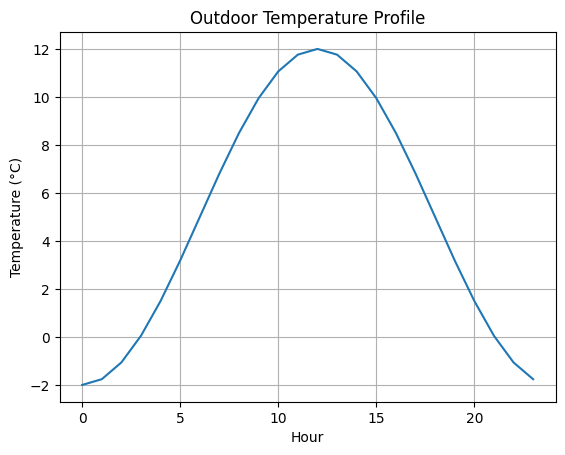
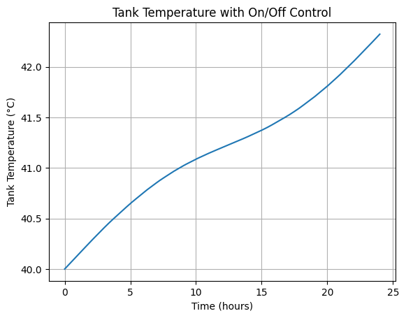

## Example Results

### Outdoor Temperature Profile

### Heat Pump COP

### Heating Load & Regression

### Tank Temperature (On/Off Control)

## Future Improvements

- Implement PID control instead of On/Off control
- Include tank heat losses to ambient
- Simulate multi-day operation
- Add seasonal performance evaluation (SCOP)
- Integrate real weather dataset input
